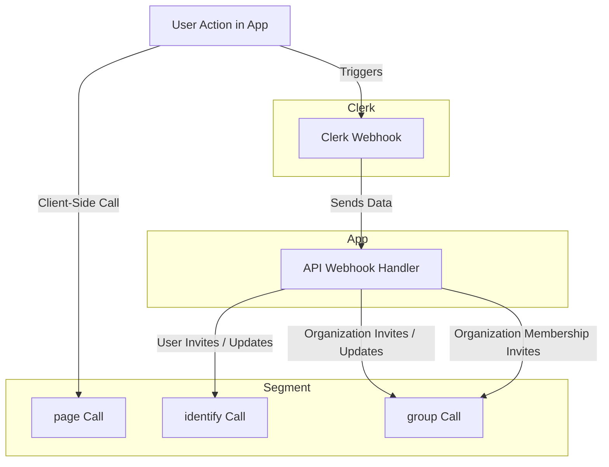

# next-forge

**Production-grade Turborepo template for Next.js apps.**

[`next-forge`](https://github.com/haydenbleasel/next-forge) is a [Next.js](https://nextjs.org/) project boilerplate for modern web application. It is designed to be a comprehensive starting point for new apps, providing a solid, opinionated foundation with a minimal amount of configuration.

## Philosophy

`next-forge` is a culmination of my experience building web apps over the last decade and focuses on a few key principles:

1. The project should be **fast**. This doesn't just mean fast to build, run and deploy. It also means it should be fast to validate ideas, iterate and scale. This is important for finding product-market fit and growing a business.
2. The project should be **cheap**, at least to start. It should avoid a flat cost, or have a generous free tier. I try to make all my projects self-sustaining, so the goal is to avoid any recurring costs upfront and find services that scale with me.
3. The project should be **opinionated**. This means that the tooling should be designed to work together, and the project should be designed to work with the tooling. This is important for reducing friction and increasing productivity.
4. The project should be **modern**. This means that the tooling should be actively maintained, and the project should be designed to take advantage of the latest features. This is important for reducing technical debt and increasing longevity.

## Structure

`next-forge` is a monorepo, which means it contains multiple packages in a single repository. This is a common pattern for modern web applications, as it allows you to share code between different parts of the application, and manage them all together.

The monorepo is managed by [Turborepo](https://turbo.build/repo), which is a tool for managing monorepos. It provides a simple way to manage multiple packages in a single repository, and is designed to work with modern web applications.

The monorepo contains the following apps:

| App | Description | Port |
| --- | ----------- | ---- |
| `api` | Contains serverless functions designed to run separately from the main app e.g. webhooks and cron jobs. | 3002 |
| `app` | The main application, featuring a [shadcn/ui](https://ui.shadcn.com/) template. | 3000 |
| `demo` | The landing page for this project. **You can delete this**. | 3006 |
| `docs` | The documentation, which contains the documentation for the app e.g. guides and tutorials. | 3004 |
| `email` | The email preview server from [react.email](https://react.email/). | 3003 |
| `studio` | [Prisma Studio](https://www.prisma.io/studio), which is a graphical editor for the database. | 3005 |
| `web` | The website, featuring a [twblocks](https://www.twblocks.com/) template. | 3001 |

It also contains the following packages:

- `@repo/database`: The database, which contains the database schema and migrations for the app.
- `@repo/design-system`: The design system, which contains shared components, utility files and styles.
- `@repo/email-templates`: The email templates, which contains the email templates for the app.
- `@repo/next-config`: The Next.js configuration, which contains the shared Next.js configuration for the app.
- `@repo/typescript-config`: The TypeScript configuration, which contains the shared TypeScript configuration for the app.

## Usage

First, scaffold the app with:

```sh
pnpm create next-app --example https://github.com/haydenbleasel/next-forge
```

Next, run the setup script. This ensures that Homebrew, NVM, pnpm, PlanetScale CLI and Stripe CLI are installed. It then installs the dependencies with pnpm and copies all `.env.example` files so you can start modifying the values. Finally, it deletes the demo folder (the landing page for this repo).

```sh
./setup.sh
```

Login to Stripe with:

```sh
stripe login
```

Login to Planetscale with

```sh
pscale auth login
```

Update your database name in:

```txt
/packages/database/package.json
```

Finally, run the development server with:

```sh
pnpm dev
```

Open the localhost URLs with the relevant ports listed above to see the app, e.g.

- [http://localhost:3000/](http://localhost:3000/) — The main app.
- [http://localhost:3001/](http://localhost:3001/) — The website.

## Deploying

`next-forge` is designed to be deployed on Vercel with the [BetterStack](https://vercel.com/integrations/betterstack) and [Sentry](https://vercel.com/integrations/sentry) integrations. This will take care of the relevant API keys and tokens.

## Analytics

`next-forge` makes use of three Analytics libraries:

| Platform   | Usage                                                                 |
|---------------------|-------------------------------------------------------------------------------------------------|
| Vercel Analytics    | Collects performance metrics, page views, and user interactions to help improve the app's performance and user experience. |
| Google Analytics    | Tracks user behavior, page views, session duration, and other engagement metrics to provide insights into user activity and marketing effectiveness. |
| Segment             | Aggregates data from various sources, including user identification, group membership, and page views, to streamline data collection and integration with other analytics and marketing tools. |

Segment in particular is handy for creating an analytics pipeline, sending user information and behaviour to a tool of your choice, like Amplitude or Mixpanel. We've wired it up as follows:



Google Analytics is also enabled if you create a `NEXT_PUBLIC_GOOGLE_ANALYTICS_ID` environment variable.

## Notes

- If you're deploying on Vercel, I recommend making use of the Team Environment Variables feature. Variables used by libraries need to exist in all packages and duplicating them can be a headache.
- `next-forge` makes use of a custom proxy setup for Segment's client-side library to avoid ad-blocker issues. This is not required, but recommended. You'll need to contact Segment support to enable this in your UI. Read more about this [here](https://segment.com/docs/connections/sources/catalog/libraries/website/javascript/custom-proxy/#custom-cdn--api-proxy).
- The `website` app has a prebuild script in order to use the Content Collections CLI directly. The files are cached and not rebuilt in the Next.js build process. This is a workaround for [this issue](https://github.com/sdorra/content-collections/issues/214).