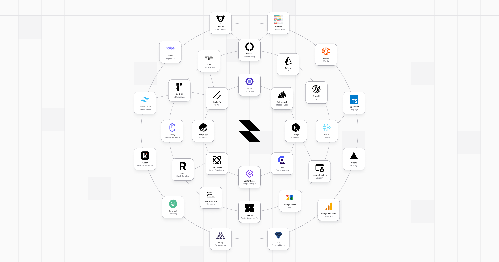

# next-forge

**A production-grade boilerplate for modern Next.js apps.**



[`next-forge`](https://github.com/haydenbleasel/next-forge) is a [Next.js](https://nextjs.org/) project boilerplate for modern web application. It is designed to be a comprehensive starting point for new apps, providing a solid, opinionated foundation with a minimal amount of configuration.

## Features

- ▲ Framework is [Next.js 14](https://nextjs.org/) (using App Directory and React Server Components) — a [React](https://react.dev/) framework for production-grade apps. Designed to be deployed on [Vercel](https://vercel.com/), but you can take it almost anywhere.
- 🤝 Full [TypeScript](https://www.typescriptlang.org/) support, including strict mode.
- 📦 React components from [shadcn/ui](https://ui.shadcn.com/), built on [Radix UI](https://www.radix-ui.com/), [Tailwind CSS](https://tailwindcss.com/) and [cva](https://cva.style/docs).
- 👩‍⚖️ Linting from [eslint-config-harmony](https://github.com/haydenbleasel/eslint-config-harmony), which provides a strict set of configuration for [ESLint](https://eslint.org/), [Prettier](https://prettier.io/) and [Stylelint](https://stylelint.io/).
- 📀 Database uses [Prisma](https://www.prisma.io/) as the ORM. Can be connected to any supported database — I recommend [PlanetScale](https://planetscale.com/).
- 📧 Emails templated by [react.email](https://react.email/) and sent using [Resend](https://resend.com/). Additionally, [Loops](https://loops.so/) form for a waitlist.
- 👨‍👩‍👧‍👦 Authentication provided by [Clerk](https://clerk.com/), which provides a secure, scalable and customizable authentication system.
- 🟢 Status provided by [BetterStack](https://betterstack.com/).
- 🪵 Log Drain provided by [Axiom](https://axiom.co/).
- 🐞 Error capturing provided by [Sentry](https://sentry.io/).
- 💸 Payments provided by [Stripe](https://stripe.com/).
- 📈 Analytics provided by [Vercel Analytics](https://vercel.com/analytics) and [Google Analytics](https://marketingplatform.google.com/about/analytics/).
- 🤖 AI provided by [Vercel AI](https://www.npmjs.com/package/ai), using OpenAI by default.
- 💬 Feedback through [Canny](https://canny.io/).
- 📝 MDX content through [Contentlayer](https://contentlayer.dev/).
- 🔔 Notifications provided by [Knock](https://knock.app/).
- 🔄 Cron jobs provided by Vercel.
- 🔠 Font is [Geist](https://vercel.com/font) by Vercel.
- 🖖 Drawer is [Vaul](https://vaul.emilkowal.ski/) by Emil Kowalski.

... plus a stack of other features for customization, security and performance.

## Philosophy

`next-forge` is a culmination of my experience building web apps over the last decade and focuses on a few key principles:

1. The project should be **fast**. This doesn't just mean fast to build, run and deploy. It also means it should be fast to validate ideas, iterate and scale. This is important for finding product-market fit and growing a business.
2. The project should be **cheap**, at least to start. It should avoid a flat cost, or have a generous free tier. I try to make all my projects self-sustaining, so the goal is to avoid any recurring costs upfront and find services that scale with me.
3. The project should be **opinionated**. This means that the tooling should be designed to work together, and the project should be designed to work with the tooling. This is important for reducing friction and increasing productivity.
4. The project should be **modern**. This means that the tooling should be actively maintained, and the project should be designed to take advantage of the latest features. This is important for reducing technical debt and increasing longevity.

## Prerequisites

You will need the following things properly installed on your computer.

- [Node.js](https://nodejs.org/)
- [pnpm](https://pnpm.io/)
- [pscale](https://planetscale.com/docs/concepts/planetscale-environment-setup)

## Usage

First, scaffold the app with:

```sh
pnpm create next-app --example https://github.com/haydenbleasel/next-forge
```

Once it is downloaded, rename `.env.example` to `.env`. This will turn the example environment variables into your local ones. This file is not committed to GitHub by default (and shouldn't be). You can do this in Terminal with:

```sh
mv .env.example .env
```

Next, update the environment variables in `.env` with your own values.

Then, update any reference of `/CompanyName/` in the legal docs. You can do this with:

```sh
grep -rl '/CompanyName/' blog/ | xargs sed -i '' 's|/CompanyName/|Acme|g'
```

Finally, run the development server with:

```sh
pnpm dev
```

Open [http://localhost:3000](http://localhost:3000) with your browser to see the result. You can start editing the page by modifying `app/page.tsx`. The page auto-updates as you edit the file.

## Deploying

`next-forge` is designed to be deployed on Vercel with the [Axiom](https://vercel.com/integrations/axiom) and [Sentry](https://vercel.com/integrations/sentry) integrations.
