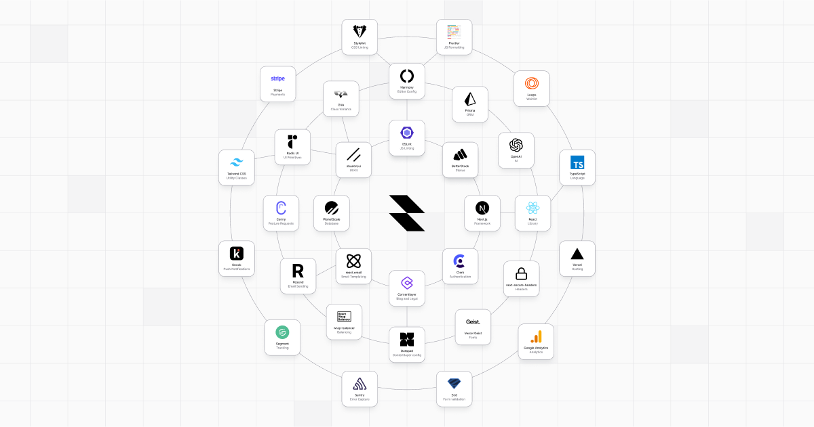

# Beskar Forge

A [Next.js](https://nextjs.org/) project boilerplate bootstrapped with [`beskar/forge`](https://github.com/beskar-co/forge). It includes everything required to create a new modern application in the Beskar ecosystem, including:

- Typescript
- Tailwind CSS
- next/font
- @vercel/analytics
- Next.js 13 App Directory
- [Harmony](https://github.com/beskar-co/harmony)
- [Gravity](https://github.com/beskar-co/gravity)
- Prisma
- Next Auth

First, scaffold the app with:

```bash
yarn create next-app --example https://github.com/beskar-co/forge
```

Once it is downloaded, rename `.env.example` to `.env`. This will turn the example environment variables into your local ones. This file is not committed to GitHub by default (and shouldn't be). You can do this in Terminal with:

```bash
mv .env.example .env
```

Then, run the development server with `yarn dev`, then open [http://localhost:3000](http://localhost:3000) with your browser to see the result. You can start editing the page by modifying `app/page.tsx`. The page auto-updates as you edit the file.
