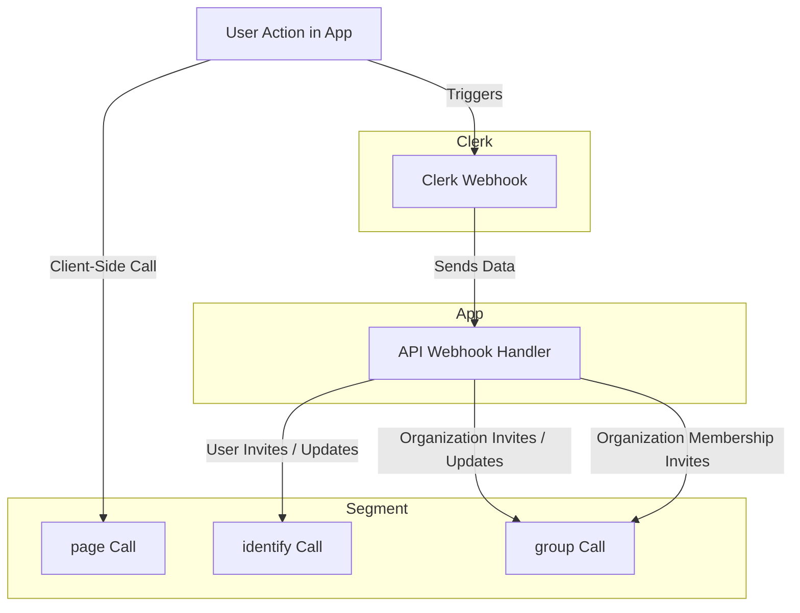

`next-forge` makes use of three Analytics libraries:

| Platform   | Usage                                                                 |
|---------------------|-------------------------------------------------------------------------------------------------|
| Vercel Analytics    | Collects performance metrics, page views, and user interactions to help improve the app's performance and user experience. |
| Google Analytics    | Tracks user behavior, page views, session duration, and other engagement metrics to provide insights into user activity and marketing effectiveness. |
| Segment             | Aggregates data from various sources, including user identification, group membership, and page views, to streamline data collection and integration with other analytics and marketing tools. |

Segment in particular is handy for creating an analytics pipeline, sending user information and behaviour to a tool of your choice, like Amplitude or Mixpanel. We've wired it up as follows:

Google Analytics is also enabled if you create a `NEXT_PUBLIC_GOOGLE_ANALYTICS_ID` environment variable.