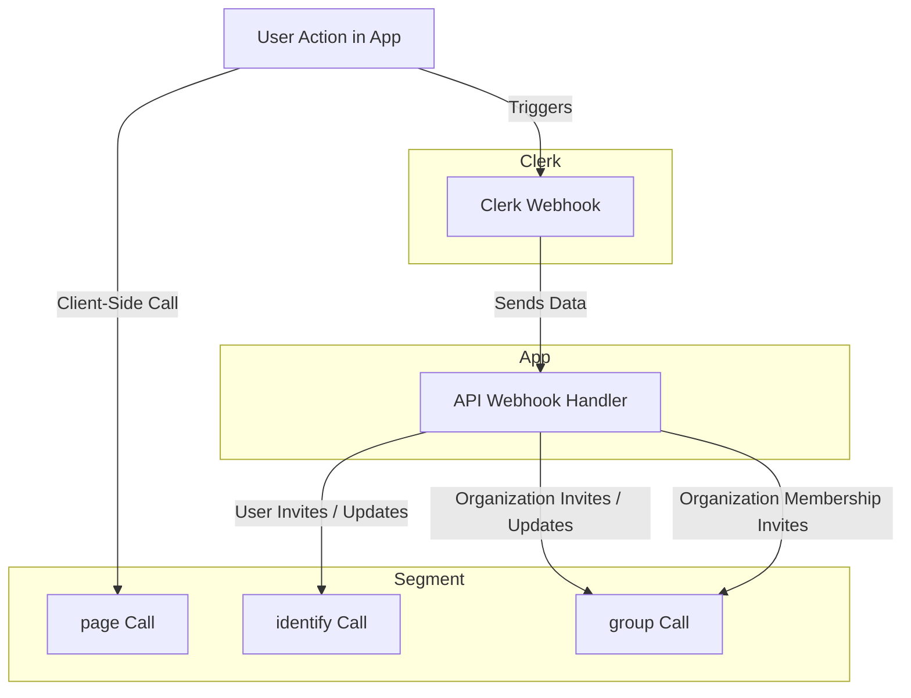

`next-forge` makes use of three Analytics libraries: Vercel Analytics, Google Analytics and Segment.

## Vercel Web Analytics

Vercel's built-in analytics tool offers detailed insights into your website's visitors with new metrics like top pages, top referrers, and demographics.

All you have to do to enable it is visit the Analytics tab in your Vercel project and click Enable from the dialog.

Read more about it [here](https://vercel.com/docs/analytics/quickstart).

## Google Analytics

Google Analytics tracks user behavior, page views, session duration, and other engagement metrics to provide insights into user activity and marketing effectiveness.

GA tracking code is injected using [@next/third-parties](https://nextjs.org/docs/app/building-your-application/optimizing/third-party-libraries#google-analytics) for performance reasons.

To enable it, simply add a `NEXT_PUBLIC_GOOGLE_ANALYTICS_ID` environment variable to your project.

## Segment

Segment aggregates data from various sources, including user identification, group membership, and page views, to streamline data collection and integration with other analytics and marketing tools.ics and marketing tools. |

It's particularly handy for creating an analytics pipeline, sending user information and behaviour to a tool of your choice, like Amplitude or Mixpanel.

We've wired it up as follows:

